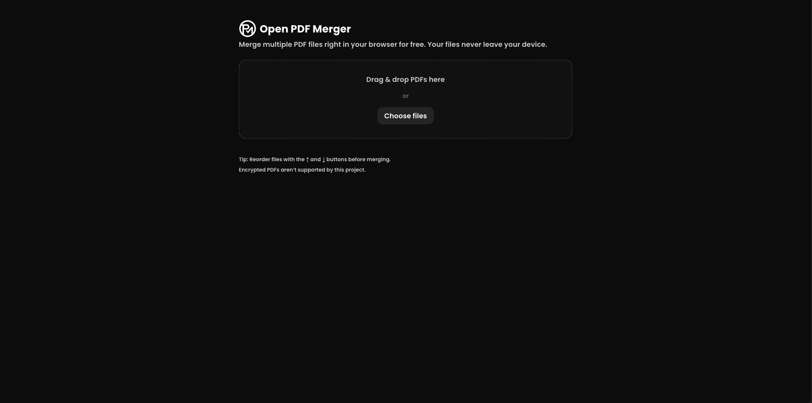
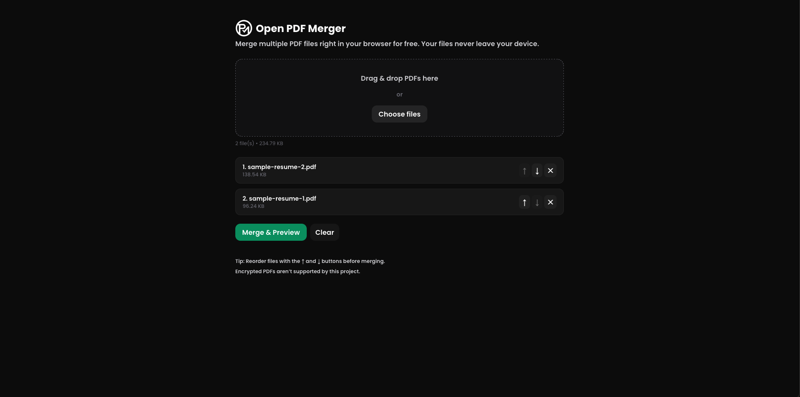
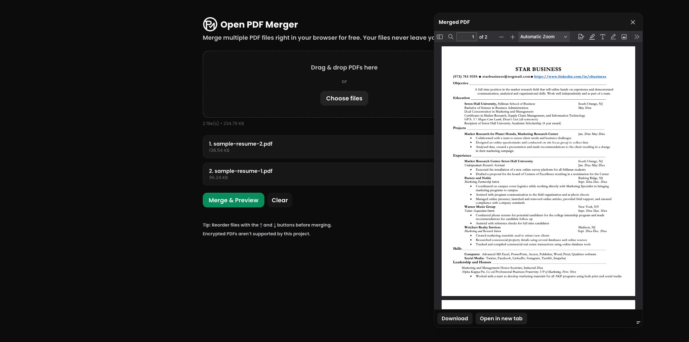
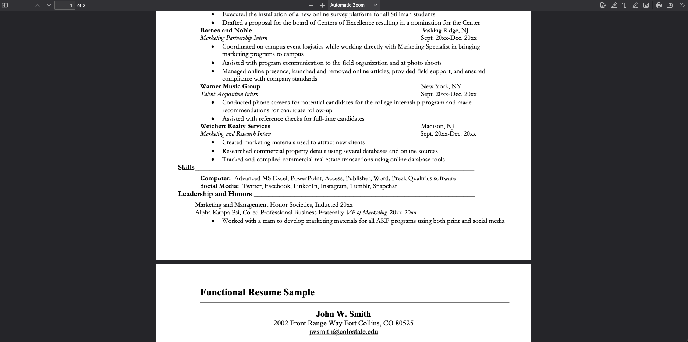

# 📄 [Open PDF Merger](https://open-pdf-merger.netlify.app) (Next.js + TypeScript)
I was making my resume and needed to merge two separate PDFs into one. Most solutions I found—Adobe Acrobat or online tools—either **cost money** or produced **low-quality results**.

So I built this: a **free PDF merging tool** that runs entirely in your browser.  
- 🔒 Files never leave your device.  
- 👀 Preview before downloading.  
- ✏️ Reorder and edit file order.  
- 📥 Download the merged PDF with one click.  

---

## 🚀 Features

- **Drag & Drop Upload**: Drop multiple PDFs into the app.  
- **Reordering**: Move files up or down in the list.  
- **Preview**: View the merged PDF in a floating window before downloading.  
- **One-click Download**: Export the final merged file.  
- **100% Client-side**: No backend, no file uploads, no privacy concerns.  

--- 

## 🛠️ Tech Stack
- [Next.js 14](https://nextjs.org/) (App Router)  
- [React](https://react.dev/)  
- [TypeScript](https://www.typescriptlang.org/)  
- [Tailwind CSS](https://tailwindcss.com/)  
- [pdf-lib](https://pdf-lib.js.org/) for PDF manipulation  

---

## 📦 Installation & Setup

Clone the repo and install dependencies:
```bash
git clone https://github.com/your-username/pdf-merger.git
cd pdf-merger
npm install
```
Run the development server:
```bash
npm run dev
```
Open [http://localhost:3000](http://localhost:3000) in your browser
or
Visit the one hosted on netlify [click here](https://open-pdf-merger.netlify.app).

---

## 📖 Usage

1. **Open the app** in your browser.  
2. **Upload PDFs** via drag-and-drop or the “Choose files” button.  
3. **Reorder files** with the ↑ / ↓ buttons.  
4. **Click “Merge & Preview”** to generate the merged PDF.  
5. **Preview in floating window**, then download or open in a new tab.  

---

## 🖼️ Demo

1. **Open PDF Merger**  
   Either drag & drop your PDFs into the app, or select them from your device.  


2. **Reorder Files**  
   Use the **↑** and **↓** buttons to arrange the PDFs in the desired order.  
   Once ready, click **Merge & Preview**.  


3. **Preview the Merge**  
   A floating preview window will appear showing the merged PDF.  
   You can resize or move the window as needed.  
   When satisfied, click **Download**.  


4. **Done! 🎉**  
   Your merged PDF is instantly downloaded — everything stays on your device.  


---

## 🤝 Contributing

PRs are welcome! If you’d like to add features (like drag-and-drop reordering, dark mode tweaks, or mobile improvements), feel free to fork and open a PR.

---

## 📜 License

This project is licensed under the **MIT License** — see the [LICENSE](./LICENSE) file for details.
